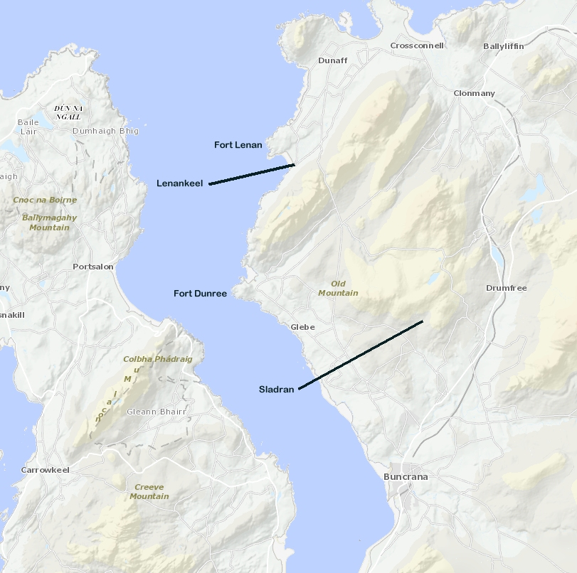

# Bristol Blenheim L9415, Donegal, December 1940

On the 21st of December 1940, Blenheim L9415 of RAF 272 Squadron Aircraft took off from RAF Aldergrove outside Belfast to carry out a convoy escort mission over the north Atlantic. On the return journey the crew of three Royal Air Force Sergeants encountered bad weather and running low on fuel, were forced to bale out of the aircraft.  

Two of the crew, the pilot Sgt Hobbs and wireless operator/Air Gunner, Sgt Newport, parachuted to the ground near the Irish army posts at Fort Lenan and Fort Dunree.

The Irish Government Information Bureau released the following statement to the newspapers on the night of the 22nd December:

"At about 8.15 last night (Saturday) a British 'plane crashed at Sledrin, some three miles north-east of Buncrana, Co. Donegal.  The 'plane was wrecked.  Before the crash the three members of the crew bailed out.  Two were found soon afterwards  They were uninjured and have been interned.  A search for the third offlicer continued during the night.  He was found this morning suffering from exposure, and is now receiving medical attention".

This was printed in a large selection of Irish, Northern Irish and Scottish newspapers.
The location where the aircraft came to grief is in many sources described as Slidrum, Sledrin.  The name of the area is and was then Sladran, near Buncrana.

An RAF Form 765 signed on the 23 December 1940 by the Officer Commanding 272 Squadron states:  Following signal refers: - 
From headquarters, R.A.F.N.I. reference No. D.S.O.2. dated 21st December 1940, Blenheim L9415 of 272 Squadron of Aldergrove believed to be aircraft seen over county Donegal this afternoon as reported by U.K. legation, Dublin.  Two members of crew are safe after parachute descent.  Third member in aircraft still missing.  Aircraft believed to have been short of petrol.

At that point in time, the RAF in Northern Ireland was still under the impression that Sgt. Ricketts was missing.  He had found himself stuck on a rock in Lough Swilly.  On the morning of the 22nd he swam ashore at Lenankeel and was initially looked after by a local woman.   He was then brought to the Irish Army post at Fort Lenan hat morning and kept there under care for two days before being sent onto the Curragh.

Upon his release in October 1943 from internment, Sgt Ricketts was interviewed and filed the following Evasion report:

1. Internment
We took off from the R.A.F. station at ALDERGROVE at 1300 hrs on 21 Dec 40 on convoy escort duty.  On the return journey we encountered bad weather, ran out of petrol, and had to bale out.  We landed at the entrance to LOUGH SWILLY, CO. DONEGAL, and were interned at THE CURRAGH.

The wreckage of the aircraft was brought to Athlone Army Barracks over 24 - 25 December.  

The three crew on the aircraft are first found flying a shipping escort mission with 272 Squadron on the 23 November 1940, the unit having being formed on the 19th November from an Aldergrove based detached flight of 235 Squadron.  That flight had been at Aldergrove for over a month  They again flew a convoy escort the following day.   They did not fly an escort mission in December until the 17th.  They flew again on the 20th.  The Squadron Operations Record Book records their next operational missions started at 12.35 on December 21st but reports only, Crashed in EIRE. interned.  The crew of three had been flying sorties with 235 Squadron from St Eval in Cornwall since the summer of 1940

## Sgt Sydney John HOBBS 742901 Pilot

HobbsSydney was born in July 1916 in Wandsworth, to Alice and of Arthur James Bray Hobbs.  By the time of his internment in the Curragh his parents lived in Battersea.

Sydney also had a letter sent to  his father, stopped by the censor, dated the 23 Dec 1941.  In it he had said:
We got into difficulties on Saturday night last and I ordered the crew to jump, and when they had gone I headed her for the hills and jumped myself.  
Both myself and my air gunner Newport got away with crooked ankles, but my 
Observer landed on a rock in the sea and had to spend the night there. He 
swam to the shore in the morning and is suffering from exposure. We have 
been very kindly treated, but am afraid this camp will send me off my head in 
no time - so will father please do the necessary.  There are three of us
 here and none of us want to stay. We still have a job to do. There are also
 three officers with us.

There is absolutely nothing more that  that I can say because there is 
nothing that I have done, but when not quite so miserable I will endeavor to write a longer letter.
